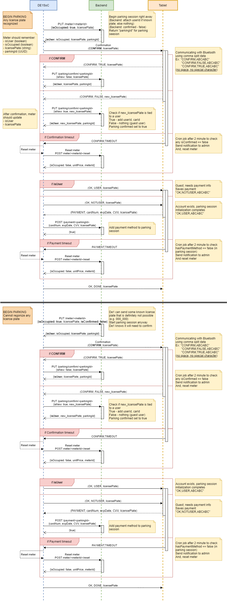

# cpen391-backend
The backend to our CPEN 391 project

# API Documentation
https://www.postman.com/steveny9911/workspace/cpen-391-backend/overview

# Flow Diagram

## Parking


## Leaving

# Set-up
**Requirement**
- NodeJS 14
- MongoDB 4

**Install**
```sh
npm install
npm ci
mongod
```

**Environment Variables**
```sh
cp .env.sample .env
```

# Running
```sh
npm start                   # start server (port 80)
npm run dev                 # run development server (port 8080)
npm test                    # run all tests (also generate coverage)
```
